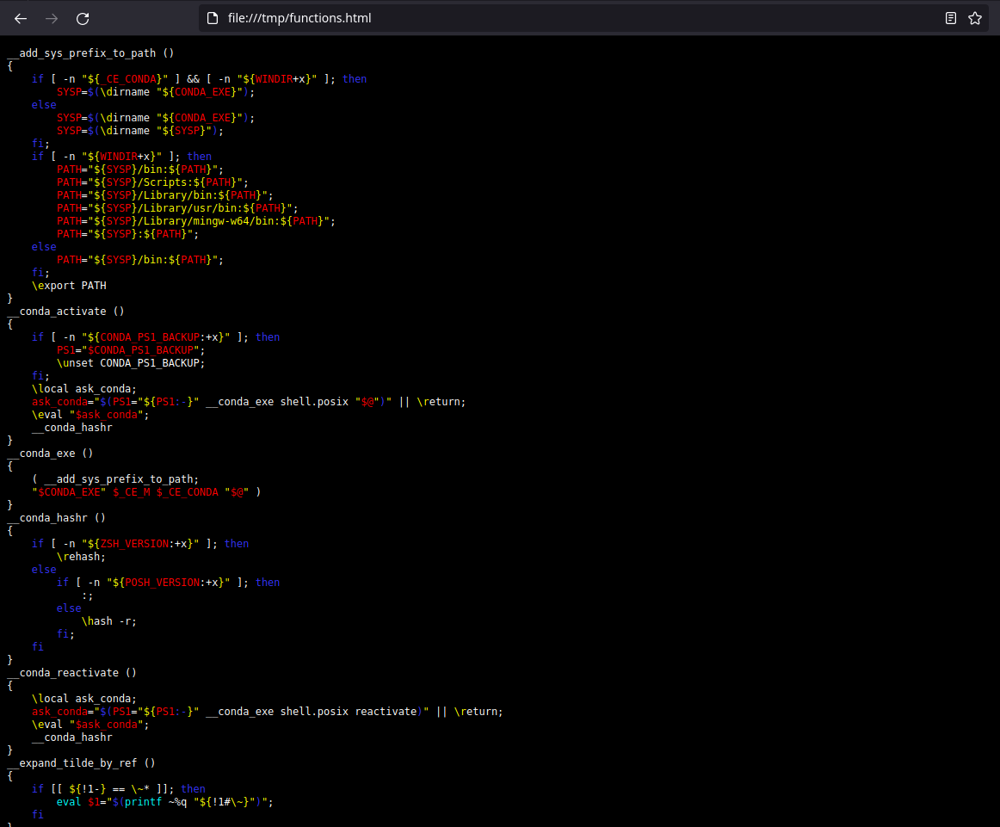

# `debug.bashrc`



This is a series of Bash functions that help with debugging Bash scripts. It is
very incomplete and right now focuses mostly on debugging name clobbering, the
problem I had that caused me to author it.

To understand what this is and why you may want it, consider this session:

```bash
$ mkdir -p "$HOME/.bash"
$ cp debug.bashrc "$HOME/.bash"
$ echo $'\n# Load debug functions\n. ~/.bash/debug.bashrc' >> ~/.bash_profile
$ . ~/.bashrc
$ syntaxhighlighter pygmentize
$ print_bash_function syntaxhighlight | syntaxhighlight bash
syntaxhighlight ()
{
    syntaxhighlight_pygmentize "$@"
}
$ syntaxhighlighter vimpager
$ print_bash_function syntaxhighlight | syntaxhighlight bash
syntaxhighlight ()
{
    syntaxhighlight_vimpager "$@"
}
$ syntaxhighlighter pygmentize && print_bash_function syntaxhighlighter | syntaxhighlight bash
syntaxhighlighter ()
{
    [ $(declare -fF syntaxhighlight) ] && unset syntaxhighlight || true;
    shopt -s nocasematch;
    case "$1" in
        pygmentize)
            function syntaxhighlight ()
            {
                syntaxhighlight_pygmentize "$@"
            }
        ;;
        vimpager)
            function syntaxhighlight ()
            {
                syntaxhighlight_vimpager "$@"
            }
        ;;
        *)
            syntaxhighlighter pygmentize;
            echo "Unrecognized highlighter!: $1" 1>&2
        ;;
    esac;
    shopt -u nocasematch
}
$ list_all_bash_functions | xargs
__add_sys_prefix_to_path __conda_activate __conda_exe __conda_hashr __conda_reactivate __expand_tilde_by_ref __get_cword_at_cursor_by_ref __git_eread __git_ps1 __git_ps1_colorize_gitstring __git_ps1_show_upstream __git_sequencer_status __load_completion __ltrim_colon_completions __nvm __nvm_alias __nvm_aliases __nvm_commands __nvm_generate_completion __nvm_installed_nodes __nvm_options __parse_options __reassemble_comp_words_by_ref _allowed_groups _allowed_users _apport-bug _apport-cli _apport-collect _apport-unpack _apport_parameterless _apport_symptoms _available_interfaces _bashcomp_try_faketty _bq_completer _cd _cd_devices _command _command_offset _complete_as_root _completer _completion_loader _configured_interfaces _count_args _dvd_devices _expand _filedir _filedir_xspec _fstypes _get_comp_words_by_ref _get_cword _get_first_arg _get_pword _gids _have _included_ssh_config_files _init_completion _installed_modules _ip_addresses _kernel_versions _known_hosts _known_hosts_real _longopt _mac_addresses _minimal _modules _ncpus _parse_help _parse_usage _pci_ids _pgids _pids _pnames _python_argcomplete _quote_readline_by_ref _rbenv _realcommand _rl_enabled _root_command _service _services _shells _signals _split_longopt _sysvdirs _terms _tilde _uids _upvar _upvars _usb_ids _user_at_host _usergroup _userland _variable_assignments _variables _xfunc _xinetd_services command_not_found_handle conda debugsh_init dequote ffstreamlength list_all_bash_functions nvm nvm_add_iojs_prefix nvm_alias nvm_alias_path nvm_auto nvm_binary_available nvm_cache_dir nvm_cd nvm_change_path nvm_check_file_permissions nvm_clang_version nvm_command_info nvm_compare_checksum nvm_compute_checksum nvm_curl_libz_support nvm_curl_use_compression nvm_curl_version nvm_die_on_prefix nvm_download nvm_download_artifact nvm_echo nvm_echo_with_colors nvm_ensure_default_set nvm_ensure_version_installed nvm_ensure_version_prefix nvm_err nvm_err_with_colors nvm_find_nvmrc nvm_find_project_dir nvm_find_up nvm_format_version nvm_get_arch nvm_get_artifact_compression nvm_get_checksum nvm_get_checksum_alg nvm_get_checksum_binary nvm_get_colors nvm_get_default_packages nvm_get_download_slug nvm_get_latest nvm_get_make_jobs nvm_get_minor_version nvm_get_mirror nvm_get_os nvm_grep nvm_has nvm_has_colors nvm_has_non_aliased nvm_has_solaris_binary nvm_has_system_iojs nvm_has_system_node nvm_install_binary nvm_install_binary_extract nvm_install_default_packages nvm_install_latest_npm nvm_install_npm_if_needed nvm_install_source nvm_iojs_prefix nvm_iojs_version_has_solaris_binary nvm_is_alias nvm_is_iojs_version nvm_is_merged_node_version nvm_is_natural_num nvm_is_valid_version nvm_is_version_installed nvm_is_zsh nvm_list_aliases nvm_ls nvm_ls_current nvm_ls_remote nvm_ls_remote_index_tab nvm_ls_remote_iojs nvm_make_alias nvm_match_version nvm_node_prefix nvm_node_version_has_solaris_binary nvm_normalize_lts nvm_normalize_version nvm_npm_global_modules nvm_npmrc_bad_news_bears nvm_num_version_groups nvm_print_alias_path nvm_print_color_code nvm_print_default_alias nvm_print_formatted_alias nvm_print_implicit_alias nvm_print_npm_version nvm_print_versions nvm_process_parameters nvm_rc_version nvm_remote_version nvm_remote_versions nvm_resolve_alias nvm_resolve_local_alias nvm_sanitize_path nvm_set_colors nvm_stdout_is_terminal nvm_strip_iojs_prefix nvm_strip_path nvm_supports_xz nvm_tree_contains_path nvm_use_if_needed nvm_validate_implicit_alias nvm_version nvm_version_dir nvm_version_greater nvm_version_greater_than_or_equal_to nvm_version_path prime-run print_all_bash_functions print_bash_function quote quote_readline rbenv syntaxhighlight syntaxhighlight_pygmentize syntaxhighlight_vimpager syntaxhighlighter
$ list_all_bash_functions '/^(nvm|conda|_).*$/' | xargs
command_not_found_handle debugsh_init dequote ffstreamlength list_all_bash_functions prime-run print_all_bash_functions print_bash_function quote quote_readline rbenv syntaxhighlight syntaxhighlight_pygmentize syntaxhighlight_vimpager syntaxhighlighter
$ print_all_bash_functions '/(_*nvm.*|_upvars)/' /tmp/functions.html
$ head -n 10 < /tmp/functions.html | syntaxhighlight html
```
```html
<?xml version="1.0" encoding="UTF-8" ?>
<!DOCTYPE html PUBLIC "-//W3C//DTD XHTML 1.0 Strict//EN" "http://www.w3.org/TR/xhtml1/DTD/xhtml1-strict.dtd">
<!-- This file was created with the aha Ansi HTML Adapter. https://github.com/theZiz/aha -->
<html xmlns="http://www.w3.org/1999/xhtml">
<head>
<meta http-equiv="Content-Type" content="application/xml+xhtml; charset=UTF-8"/>
<title>stdin</title>
</head>
<body style="color:white; background-color:black">
<pre>
```
## Configuration

### `$BASH_SYNTAXHIGHLIGHTER_BINREQ`

You may add e.g.:

```bash
export BASH_SYNTAXHIGHLIGHTER_BINREQ="vimpager"
```

*Before* sourcing debug.bashrc, to use `vimpager` instead of `pygmentize` as default syntax highlighter.

## Plugins

### `Ddiffshopt`

```bash
(base) fred@マパチェ🦝⟿ ~$ shopt -u expand_aliases
(base) fred@マパチェ🦝⟿ ~$ Ddiffshopt
# Recall: Additions are changes from default to current subshell.
#	Lines with no red words for context only.

shopt -u dotglob
shopt -u execfail
shopt [--s-] {+-u+} expand_aliases
shopt -u extdebug
shopt -s extglob
```

### `Deval`

```bash
$ Deval 'for f in x a d; do echo $f; done'
+ eval for f in x a 'd;' do echo '$f;' done
for f in x a d; do echo $f; done
++ for f in x a d
++ echo x
x
++ for f in x a d
++ echo a
a
++ for f in x a d
++ echo d
d
+ for setting in x v
+ [[ ! x =~ himBHs ]]
+ set +x
```

## License

(c) 2022 Fredrick R. Brennan &lt;copypaste@kittens.ph&gt;

    Licensed under the Apache License, Version 2.0 (the "License");
    you may not use this file except in compliance with the License.
    You may obtain a copy of the License at

        http://www.apache.org/licenses/LICENSE-2.0

    Unless required by applicable law or agreed to in writing, software
    distributed under the License is distributed on an "AS IS" BASIS,
    WITHOUT WARRANTIES OR CONDITIONS OF ANY KIND, either express or implied.
    See the License for the specific language governing permissions and
    limitations under the License.
